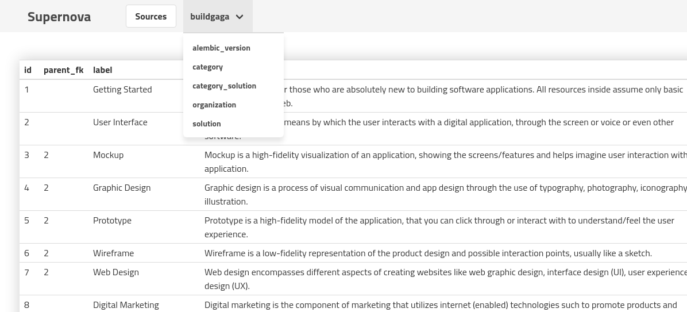

# Supernova

## Admin for MySQL/PostgreSQL data

- Aim to be like Django admin
- Language/framework agnostic

**This is super young product, under development, use with caution**

### A rough roadmap for near future

- Have a great data viewer
- Inference of data/structure be as magical as possible (thank you SQLAlchemy)
- Sane defaults, minimal config for edge cases
- Support common data types including Geo, Date, Time, URL, media
- Editor for single row, with specific widgets for each data type supported
- Editor with related data (current-to-one/many related)
- Easy bulk operations
- Integrate custom operations (like re-send verification email) through exiting HTTP API of app backend
- No authentication/authorization, except to run within company network

